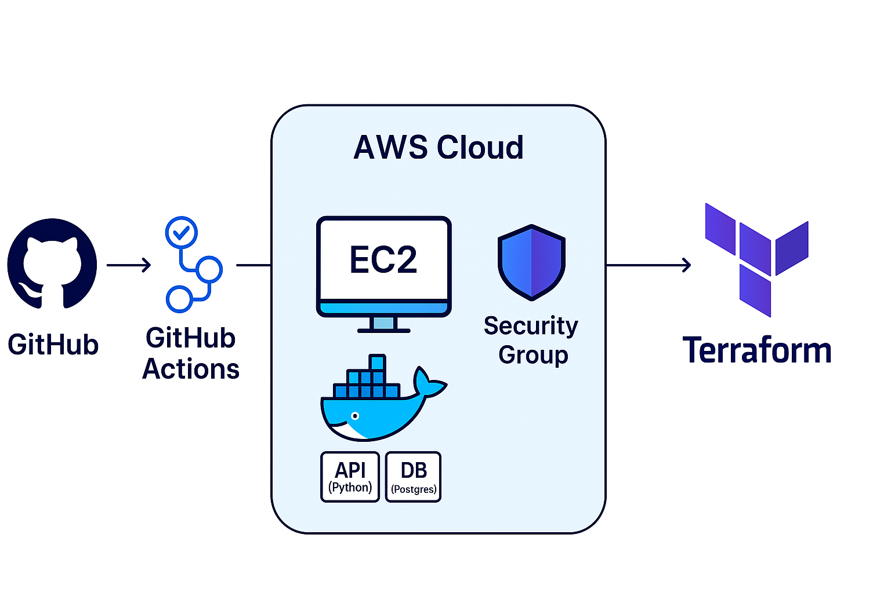

# Projeto DevOps: API Multi-Container com Deploy Automatizado na AWS

[](https://github.com/vitorhgdev/projeto-devops-aws/actions/workflows/ci.yml)

<p align="left">
  
  
  
  
  
  
</p>

## 🚀 Sobre o Projeto

Este projeto é uma demonstração **completa (de ponta-a-ponta)** de um fluxo de trabalho DevOps. O objetivo foi pegar uma aplicação web multi-container (API Python/Flask + Banco de Dados PostgreSQL) e automatizar todo o seu ciclo de vida.

Este repositório serve como um case prático das minhas habilidades em Cloud, DevOps, Automação e Segurança.

## ✨ Principais Features

Este projeto demonstra as seguintes habilidades e conceitos:

* **Infraestrutura como Código (IaC):** Provisionamento de toda a infraestrutura (EC2, Security Groups) na AWS com `Terraform`.
* **Deploy Automatizado:** Script de `user_data` que instala o Docker e sobe a aplicação na nuvem com um único `terraform apply`.
* **Containerização:** Aplicação e Banco de Dados 100% containerizados com `Docker` e `Docker Compose`.
* **Pipeline de CI/CD (GitHub Actions):**
    * **Linting:** Verificação de estilo de código com `flake8`.
    * **Testes:** Testes unitários com `pytest` em um ambiente real (subindo os containers).
* **Segurança (DevSecOps):**
    * Gerenciamento de segredos locais com `.env` e `GitHub Secrets` para o pipeline de CI.
    * Configuração de `Security Group` (firewall) restritivo na AWS.
    * Uso de usuário não-root dentro do `Dockerfile`.

## 🏗️ Diagrama da Arquitetura




---

## ⚙️ Como Executar o Projeto

Existem duas formas de executar este projeto:

### Opção 1: Deploy Automatizado na AWS (Recomendado)

Esta opção provisiona a infraestrutura completa na nuvem e faz o deploy da aplicação.

**Pré-requisitos:**
* Conta na AWS (pode ser o [**AWS Academy Learner Lab**]]).
* Terraform e Git instalados.

**Passos:**

1.  Clone o repositório:
    ```bash
    git clone [https://github.com/vitorhgdev/projeto-devops-aws.git](https://github.com/vitorhgdev/projeto-devops-aws.git)
    cd projeto-devops-aws
    ```
2.  Configure suas credenciais da AWS no seu terminal (necessário se estiver usando o Learner Lab).
3.  **(Importante: Segurança)** Edite o arquivo `main.tf`, na regra do `aws_security_group` da porta 22 (SSH), e troque `"0.0.0.0/0"` pelo seu IP público (descubra no Google "meu ip") seguido de `/32`.
4.  Inicialize o Terraform:
    ```bash
    terraform init
    ```
5.  Aplique a infraestrutura (o deploy pode levar de 3 a 5 minutos):
    ```bash
    terraform apply
    ```
    (Digite `yes` para confirmar).

6.  Ao final, o Terraform mostrará o IP público do servidor. Acesse no seu navegador:
    `http://SEU_IP_PUBLICO:5001`